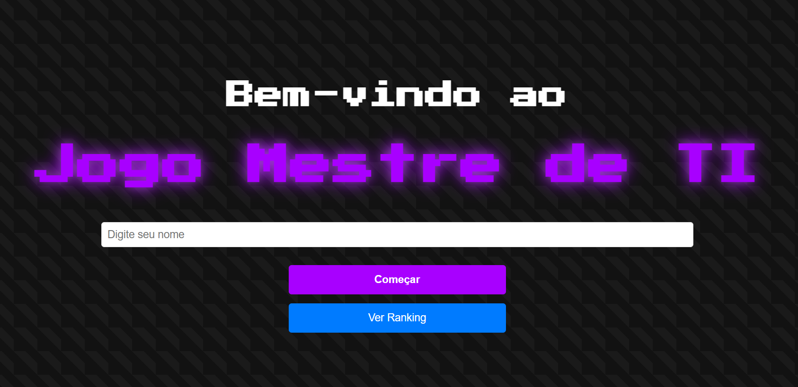
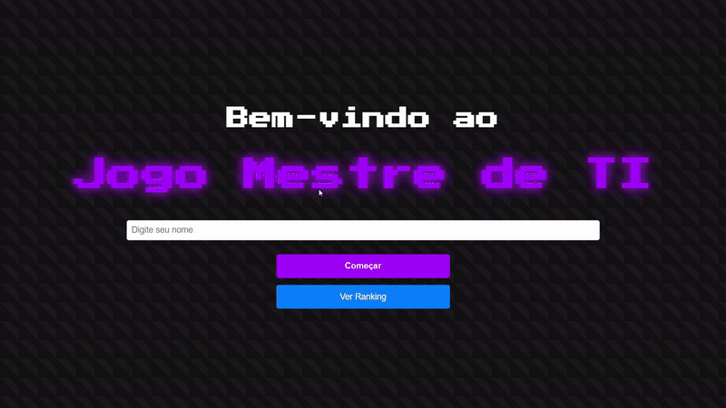

# Projeto Quiz-Game

## Descrição geral
Durante o desenvolvimento deste projeto acadêmico, nossa equipe teve o desafio de criar um quiz interativo do zero, inteiramente focado em perguntas sobre Tecnologia da Informação. O objetivo do jogo foi proporcionar uma experiência dinâmica e desafiadora para os jogadores, testando seus conhecimentos na área e incentivando o aprendizado de forma gameficada.

O quiz foi estruturado com um sistema de níveis progressivos, totalizando cinco níveis de dificuldade com 30 segundos de resposta por pergunta. À medida que o jogador avança, as perguntas se tornam mais complexas. Além disso, a partir do quarto nível, cada resposta incorreta resulta na perda de 10 pontos, tornando o jogo mais competitivo e estratégico.

Para auxiliar os jogadores, implementamos algumas funcionalidades adicionais, como a possibilidade de eliminar alternativas incorretas, pular questões e continuar jogando sem perder pontos nessas situações. Essas mecânicas foram pensadas para manter o engajamento do usuário e oferecer uma experiência mais equilibrada.

Outra funcionalidade essencial do projeto foi o sistema de ranking. Todas as pontuações e nomes dos jogadores são armazenados em um arquivo JSON, permitindo que os resultados sejam acessados posteriormente. Essa abordagem possibilita a criação de um histórico de desempenho e a comparação entre os participantes, estimulando a competitividade e incentivando melhorias no conhecimento técnico.

O desenvolvimento do quiz exigiu o uso de diversas tecnologias e metodologias, incluindo manipulação de arquivos JSON para persistência de dados, lógica de programação para controle de pontuação e progressão de níveis, além de princípios de design para garantir uma interface intuitiva e interativa. A experiência de trabalhar em equipe foi fundamental para a conclusão do projeto, proporcionando aprendizado prático e reforçando habilidades essenciais no desenvolvimento de software.

## Tecnologias usadas:

## Resultados

